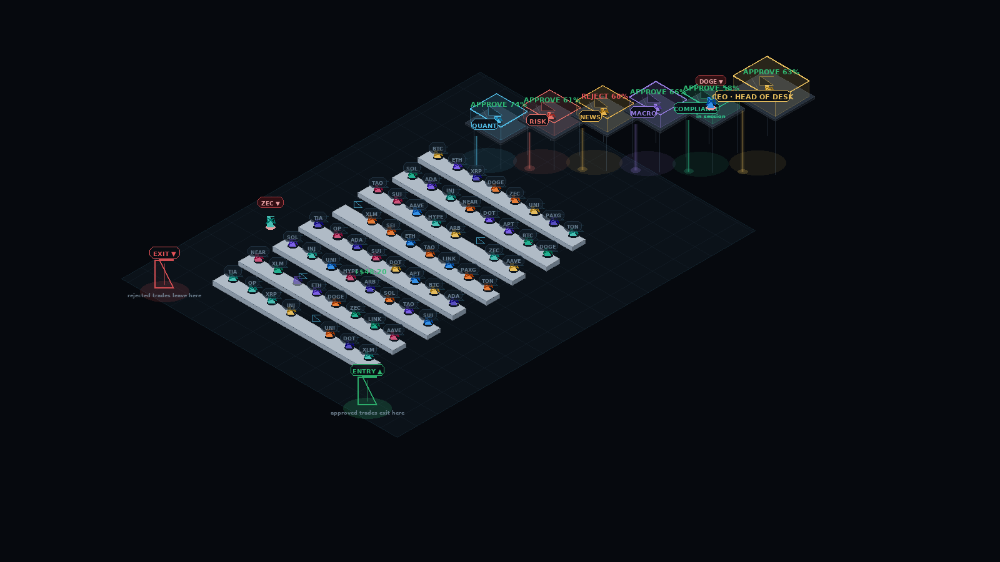
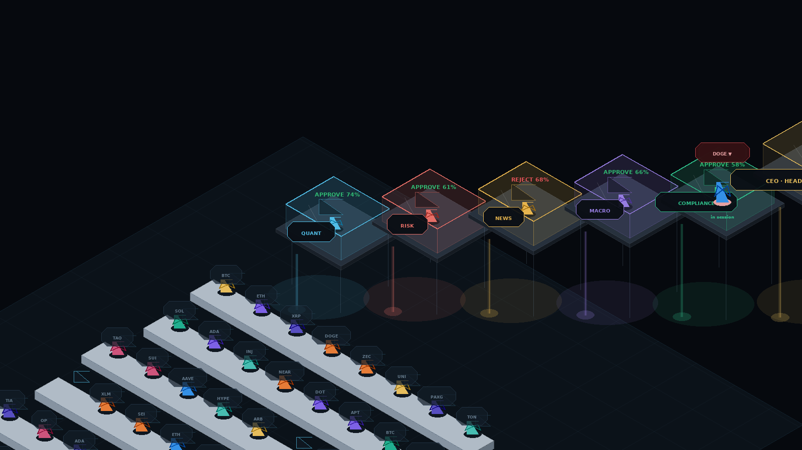

# SOUL EXTER — an LLM trading floor



A trading floor you can watch. Dozens of traders sit at desks — each one is a trade the scanner
found. Five glass cabins hold **five different open-source LLMs**, one per risk discipline. Every
trade walks from cabin to cabin, collecting verdicts, until it either takes the **entry door**
(approved), the **exit door** (rejected), or gets escalated to the **CEO cabin** — a sixth, larger
LLM that owns the final call.

**No API keys. No paid endpoints. All weights are open and ungated** (they download anonymously).

```
                    ┌──────────── the council ────────────┐
   desk             │  QUANT   RISK   NEWS   MACRO   COMPL.│        CEO
  (scanner) ───────▶│  Qwen     Mistral Zephyr Qwen    Phi │──────▶ Qwen-14B ──▶ ENTRY / EXIT
   trade packet     │  7B       7B      7B     3B      mini │        (only if the council splits)
                    └──────────────────────────────────────┘
```

---

## The rules of the floor

| Council result | Where the trader goes |
|---|---|
| **5 of 5 approve** | straight through the **entry door** → a paper position is opened |
| **0 of 5 approve** | straight out the **exit door** |
| **1–4 approve** (a split) | up to the **CEO cabin**; the CEO reads all five verdicts and decides the door |

Every cabin returns more than a yes/no: a **confidence %**, **risk flags**, and a **size
multiplier**. So a desk can say *"approve, but at half size, and watch the spread"* — and the paper
desk actually opens the position at half size.

Each cabin sees the trade packet (entry, stop, target, R:R, strategy, full feature set), the live
market read, the current book, **and the verdicts of the cabins before it**. The CEO sees the whole
transcript plus the tally.

### Two things worth knowing up front

**1. Wave mode is on by default.** On a T4, five cabins answering back-to-back takes 2–3 minutes per
trade. Instead the cabins run in two waves:

- wave 1: QUANT, RISK, NEWS — in parallel, each reasoning independently
- wave 2: MACRO, COMPLIANCE — in parallel, both reading all three wave-1 verdicts
- then the CEO

That is ~3× faster, and each cabin still sees every *earlier stage*. The trade-off: cabins in the
same wave cannot see each other. If you want the strict sequence
`QUANT → RISK → NEWS → MACRO → COMPLIANCE → CEO` where every cabin reads all of its predecessors,
set `SOUL_WAVE_MODE=0`. Both modes are covered by tests.

**2. It is a paper desk.** Positions are simulated against real prices, with real risk rules
(0.75% of equity risked per trade, 3% session risk cap, no leverage, max 8 open). Nothing is sent to
an exchange.

---

## Quick start (local, no GPU)

The pipeline is real; only the model weights are replaced by deterministic persona brains.

```bash
python -m venv .venv && . .venv/bin/activate
pip install -r requirements.txt
SOUL_MOCK_LLM=1 python -m soul
# open http://localhost:8000
```

You get the full floor: scanner → 5 cabins → CEO → doors → paper P&L, with a live 3D view.

> Point a tunnel at it if you want to watch from your phone: `cloudflared tunnel --url http://localhost:8000`

## Running it on a free Kaggle GPU

**That is the intended deployment.** The notebook is `kaggle/soul_exter_kaggle.ipynb`.

1. Kaggle → *Create → Notebook* → **Settings → Accelerator → GPU T4 x2** and **Internet → On**.
2. Upload/import the notebook from this repo and run the cells in order.
3. Cell 5 prints a public `https://…trycloudflare.com` URL. Open it — that is your floor, served
   from Kaggle, with the websocket stream intact. Your laptop runs nothing.

First run downloads ~25 GB of weights into `/kaggle/working/hf` (kept across saves if you commit the
notebook output). Roughly 10–15 minutes, then the cabins start filling.

### Model roster

Every model below is **ungated** — `huggingface_hub` can fetch it with no token and no license
click. That is why there is no Llama and no Gemma in the list (both require an account + terms).

| cabin | model | 4-bit size | license |
|---|---|---|---|
| QUANT | `Qwen/Qwen2.5-7B-Instruct` | ~5.0 GB | Apache-2.0 |
| RISK | `mistralai/Mistral-7B-Instruct-v0.3` | ~5.0 GB | Apache-2.0 |
| NEWS | `HuggingFaceH4/zephyr-7b-beta` | ~5.0 GB | MIT |
| MACRO | `Qwen/Qwen2.5-3B-Instruct` | ~2.4 GB | Apache-2.0 |
| COMPLIANCE | `microsoft/Phi-3.5-mini-instruct` | ~2.6 GB | MIT |
| **CEO** | `Qwen/Qwen2.5-14B-Instruct` | ~9.5 GB | Apache-2.0 |

2 × T4 = 32 GB, and the pool keeps the most recently used models resident
(`SOUL_MODEL_CACHE`, default 6). Profiles: `SOUL_MODEL_PROFILE=low|standard|variety`.

---

## Configuration

Everything is an environment variable; nothing else needs editing.

**Floor behaviour**

| variable | default | meaning |
|---|---|---|
| `SOUL_MOCK_LLM` | auto | `1` forces the synthetic personas. Auto-detects: no CUDA → mock |
| `SOUL_WAVE_MODE` | `1` | `0` = strictly sequential cabins (every cabin reads all predecessors) |
| `SOUL_SCAN_SECONDS` | `25` | how often the scanner looks for setups |
| `SOUL_MIN_SCORE` | `0.28` | scanner conviction threshold (0–1) |
| `SOUL_MAX_CANDIDATES` | `3` | trades per scan |
| `SOUL_MAX_IN_FLIGHT` | `6` | trades allowed on the floor at once |
| `SOUL_TRADE_COOLDOWN` | `420` | don't re-review the same symbol+side+strategy for N seconds |
| `SOUL_DESKS` | `64` | desk count on the floor (cosmetic) |

**Models**

| variable | default | meaning |
|---|---|---|
| `SOUL_MODEL_PROFILE` | `standard` | `low` / `standard` / `variety` |
| `SOUL_LOAD_4BIT` | `1` | bitsandbytes NF4 quantisation |
| `SOUL_MODEL_CACHE` | `6` | how many models stay in VRAM |
| `SOUL_LLM_CONCURRENCY` | `3` | cabins generating at the same time |

**Desk / risk**

| variable | default | meaning |
|---|---|---|
| `SOUL_STARTING_CASH` | `15000` | paper equity |
| `SOUL_RISK_PCT` | `0.75` | % of equity risked per trade |
| `SOUL_SESSION_RISK_PCT` | `3.0` | cap on total open risk |
| `SOUL_MAX_OPEN` | `8` | max concurrent positions |
| `SOUL_MAX_LEVERAGE` | `1.0` | 1.0 = spot, no leverage |

**Market data**

| variable | default | meaning |
|---|---|---|
| `SOUL_MARKET_SOURCE` | `auto` | `auto` / `ccxt` (live public Binance) / `sim` |
| `SOUL_VENUE` | `binance` | any ccxt exchange with public endpoints |
| `SOUL_TIMEFRAME` | `5m` | candle timeframe |
| `SOUL_SIM_BAR_SECONDS` | `8` | simulator: wall-clock seconds per simulated 5m bar |

Live data uses ccxt against public REST endpoints — **no API key, ever**. If Kaggle has no internet
(or ccxt is missing), `auto` falls back to the built-in correlated simulator and the badge in the UI
tells you which is running.

---

## What is on screen

- **The floor** — 64 desks in eight rows, each trader tagged with the pair it is trading. Idle desks
  show dim tags; a trade lights up its desk, stands up and walks.
- **The five cabins + CEO** — glass rooms on elevated platforms, connected by lit access shafts.
  Each cabin has its own colour, its model name in the roster panel, and shows `thinking…` while it
  reasons, then its verdict, confidence and one-line reason.
- **The doors** — the green **ENTRY** door and the red **EXIT** door at the bottom of the floor.
- **The HUD** — equity and equity curve, open positions with live P&L, realised P&L, win rate,
  risk used, and the council tally (entry / exit / escalated).
- **The roster** — which open-source model is sitting in which cabin, and its last verdict.
- **Floor log** — a live event tape (spawns, verdicts, escalations, fills, closes, blocks).
- **Click any trader or cabin** for the full council transcript: every verdict, confidence, flag,
  latency and model name.



Above: the six cabins mid-session — five desks holding their verdicts and the CEO's roof lit. Each
cabin's operator sits inside, the access shaft below is the rail the trader rode up, and the light
pool on the floor marks its landing spot.

The 3D view is a renderer of the engine's event stream only — it holds no trading logic. Pan by
dragging, zoom with the wheel.

---

## HTTP API

| method | path | purpose |
|---|---|---|
| `GET` | `/` | the floor |
| `GET` | `/api/state` | full snapshot (engine, market, council, desk, positions, roster) |
| `GET` | `/api/trades` | audit log of every trade the floor has seen |
| `GET` | `/api/trades/{id}` | full council transcript for one trade |
| `POST` | `/api/scan` | force a scan now |
| `POST` | `/api/control` | `{paused, scan_seconds, min_score, max_candidates}` |
| `POST` | `/api/demo/seed` | `{count}` push candidates straight onto the floor |
| `POST` | `/api/demo/shock` | inject volatility into the tape |
| `POST` | `/api/desk/close-all` | flatten the paper book |
| `WS` | `/ws` | realtime event stream (the UI falls back to SSE, then polling) |

---

## Project layout

```
soul/
  config.py        env-driven configuration + the vote rules
  models.py        TradeCandidate, Verdict, CouncilResult, Position
  market.py        ccxt public data + offline correlated simulator
  scanner.py       5 numpy strategies, shared feature block, scoring, cooldowns
  council.py       the five cabins, wave scheduling, CEO escalation
  desk.py          paper fills, sizing, stops/targets, P&L
  engine.py        wires it together and publishes events
  api.py           FastAPI + websocket + SSE
  bus.py           async pub/sub
  brains/
    base.py        cabin personas, prompt construction, verdict parsing
    local_hf.py    4-bit transformers models on GPU  (Kaggle path)
    mock.py        deterministic persona brains      (no-GPU path)
web/
  index.html       HUD markup
  style.css        glass-panel styling
  floor.js         isometric renderer (canvas 2D)
  app.js           event stream -> floor + HUD binding
kaggle/
  soul_exter_kaggle.ipynb   the whole thing, cells in order
tools/
  floor_smoke.mjs  headless floor harness (no browser needed)
  render_floor.py  rasterise a captured frame to PNG
  tune_mock.py     calibrate the mock personas
tests/
  test_council.py  routing, parsing, prompts, cabins, desk, calibration
```

## Tests

```bash
python -m pytest tests/ -q          # 29 tests
python tools/tune_mock.py           # shows the outcome distribution of the mock council
node tools/floor_smoke.mjs /tmp/f.json && python tools/render_floor.py /tmp/f.json floor.png
```

`tools/floor_smoke.mjs` drives a whole trade — five cabins, CEO, both doors — through `web/floor.js`
against a stubbed canvas, so the renderer is verified without a browser. `render_floor.py` rasterises
the captured frame to a PNG for visual review.

## Honest limitations

- The scanner is a compact, readable quant stack — five classic strategies. It is the *subject* of
  the floor, not a proven edge.
- A T4 generates ~10–25 tokens/second on a 7B model. Cabins answering in parallel gets you roughly
  **1–3 completed trades per minute**; strictly sequential mode is 3–4× slower.
- The CEO is one model reading a transcript, not a committee of one — it can still be wrong.
- Real exit liquidity, fees and slippage are only approximated (a spread proxy and an ATR-based
  stop); the paper fills are optimistic.
- Not financial advice, and not connected to an exchange. Do not wire this to real money without
  doing the work on the scanner, the sizing and the kill-switch yourself.
