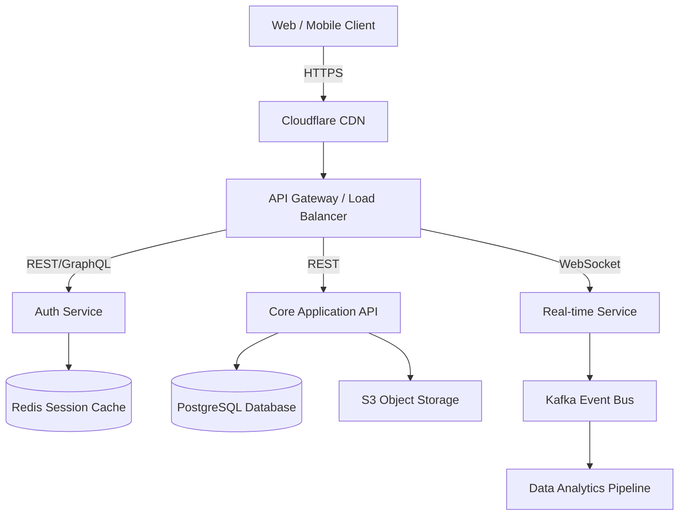

# System Architecture: Scalable_Backend
*Generated by Jarvis Architect Module*

## 1. High-Level System Diagram
This diagram maps out the microservices, databases, and load balancers.
(You can paste this code into [Mermaid Live Editor](https://mermaid.live) to visualize it).

## 2. Infrastructure Choices
* **Database**: PostgreSQL (Relational consistency) + Redis (High-speed caching).
* **Compute**: Docker Containers running on Kubernetes (K8s) or AWS ECS.
* **Messaging**: Apache Kafka for asynchronous event-driven communication.
